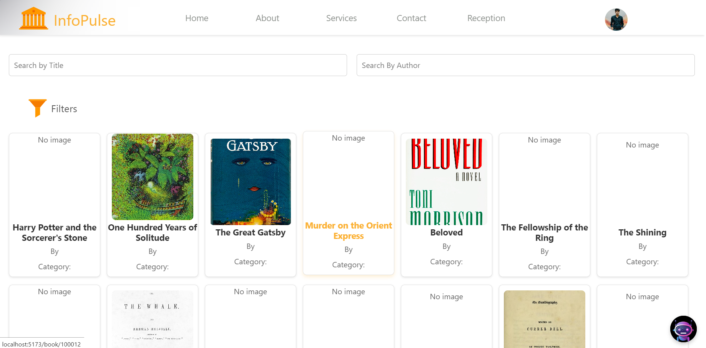

<h1 align="center">Interactive Library Managment System</h1>

Welcome to our state-of-the-art Interactive Library Management System, where discovering your next great read has never been easier. Seamlessly designed to enhance your library experience, this system allows you to effortlessly search for books, borrow them with a single click, and even reserve your favorite titles for a specific time period. Whether you're a book lover or a researcher, our platform offers a smooth, intuitive interface that brings the world of knowledge to your fingertips. Dive into a universe of literature and manage your reading journey with style and ease.

## 🚀 Features

- **Book Search**: Effortlessly search for books by title, author, or genre.
- **Borrow Books**: Borrow available books with a single click.
- **Reserve Books**: Reserve books for a specific time period.
- **User Dashboard**: Manage your borrowed and reserved books from a personalized dashboard.
- **Responsive Design**: Enjoy a seamless experience across all devices.
## Technologies Used
### Frontend
- **React**: A JavaScript library for building user interfaces.
- **React Router**: For managing navigation and routing in the application.
- **Axios**: For making HTTP requests to the backend API.
- **Bootstrap**: For responsive and modern UI design.
- **React Icons**: For incorporating icons seamlessly into the UI.

### Backend
- **Node.js**: JavaScript runtime for building the backend server.
- **Express.js**: A minimal and flexible Node.js web application framework for API development.
- **MySQL**: A relational database management system for storing and managing data.

## Getting Started

### Prerequisites

Before you begin, ensure you have met the following requirements install your computer:

- **Node.js**
- **MySQL** 

### Installation
1. **Clone the repository:**
    ```bash
   git clone https://github.com/WimukthiMadushan/Interactive-library-management-system-.git
   cd interactive-library-management-system
    
2. **Install frontend dependencies:**

   ```bash
   cd Frontend
   npm install


3. **Install backend dependencies:**

   ```bash
   cd Backend
   npm install

### Running the Application

1. **Set up the MySQL Database:**

   - Create a MySQL database named `library_management` in local mysql database.

2. **Set up environment variables:**

   - Modify Database.js file in the Backend folder. And change accoring to your data.

     ```plaintext
     HOST=localhost
     USER=root
     PASSWORD=yourpassword
     DB_NAME=library_management
     ```

3. **Start the backend server:**

   ```bash
   cd Backend
   npm start

4. **Start the frontend server:**

   ```bash
   cd Frontend
   npm start

   
## 📸 Screenshots

### Home Page


### Book Search


### User Profile


